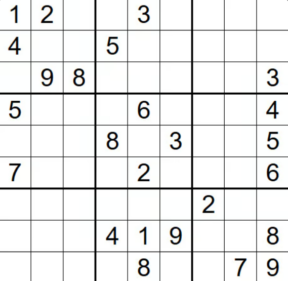

# 36. Valid Sudoku

## Problem Statement-

We are given `9x9` Sudoku board. A sudoku board is valid if following rules are followed:

1. Each row must contain digits `1-9` without duplicates.  
2. Each column must contain digits `1-9` without duplicates.  
3. Each of the nine `3x3` sub-boxes of grid must contain digits `1-9` without duplicates.

Return `true` if sudoku is valid otherwise `false`.

## Understanding the Problem Statement-

A sudoku board is given which is of size `9x9`, with `3x3` sub-boxes. The input is given such that the empty cells are indicated with `’.’`. So we have to keep in mind that if a row or column contains any digits from `1-9` once, then in the same row or column any duplicate of that number should not be present.  
Now, we should be careful for `3x3` sub-boxes also. If duplicate is present in it, it means in the whole `9x9` board, duplicates is present, so we return `false` for this.

## 1. Brute Force Approach-

For every row, column and sub-boxes, we can keep a set of seen digits and ensure that no number appears twice. If any duplicate is found then it is invalid board.

### Algorithm:

1. Check all rows:  
    * For each index `row` from `0` to `8`:  
        - [ ] Create an empty set `seen`.  
        - [ ] For each column index `i` from `0` to `8`:  
    * Skip if cell is `“.”`  
    * If value is in `seen` return `false`  
    * Otherwise add to `seen`.  
2. Check all columns:  
    * For each column index `col` from `0` to `8`:  
        - [ ] Create an empty set `seen`.  
        - [ ] For each row index `i` from `0` to `8`:  
    * Skip if cell is `“.”`  
    * If value is in `seen` return `false`  
    * Otherwise add to `seen`.  
3. Check all `3x3` boxes:  
    * Number the boxes from `0` to `8`.  
    * For `i` in `0-2` and `j` in `0-2`:  
        - [ ] Compute:  
    * `row = (sqaure // 3) * 3 + i`  
    * `col = (sqaure % 3) *3 + j`  
        - [ ] Skip if cell is `“.”`  
        - [ ] If value is in `seen` return `false`  
        - [ ] Otherwise add to `seen`.  
4. If no duplicates then return `true`.

### Working with Test Cases:

**Test Case1:**  
Input: `board=`  
`[["1","2",".",".","3",".",".",".","."],`  
`["4",".",".","5",".",".",".",".","."],`  
`[".","9","8",".",".",".",".",".","3"],`  
`["5",".",".",".","6",".",".",".","4"],`  
`[".",".",".","8",".","3",".",".","5"],`  
`["7",".",".",".","2",".",".",".","6"],`  
`[".",".",".",".",".",".","2",".","."],`  
`[".",".",".","4","1","9",".",".","8"],`

`[".",".",".",".","8",".",".","7","9"]]`

Output: `true`  
Explanation:




For row `0`: seen is empty add `{1}`, `{1,2}`, skip `.`, `{1,2,3}`  
In row1: also add every element except `.` since no duplicates are present.  
In row2: add `9, 8, 3`  
And from row3 to row8, digits appear only once and dots are skipped, so all rows are valid.  
For column `0`: seen is empty so add `1, 4, 5, 7`  
Similarly with row1 to row8 keep on adding by skipping `.`  
For Sqaure `0`: Top left: `seen = {1,2,4,9,8}`  
For Sqaure `1`: Top middle: `seen = {3,5}`  
For Sqaure `2`: Top right: `seen = {3}`  
For Square `4`: Center: `seen = {6,8,3,2}`  
Remaining squares : all digits are unique.  
As no duplicates are found, return `true`.

### Solution:

```java  
public class Solution {  
    public boolean isValidSudoku(char[][] board) {  
        for (int row = 0; row < 9; row++) {  
            Set<Character> seen = new HashSet<>();  
            for (int i = 0; i < 9; i++) {  
                if (board[row][i] == '.') continue;  
                if (seen.contains(board[row][i])) return false;  
                seen.add(board[row][i]);  
            }  
        }

        for (int col = 0; col < 9; col++) {  
            Set<Character> seen = new HashSet<>();  
            for (int i = 0; i < 9; i++) {  
                if (board[i][col] == '.') continue;  
                if (seen.contains(board[i][col])) return false;  
                seen.add(board[i][col]);  
            }  
        }

        for (int square = 0; square < 9; square++) {  
            Set<Character> seen = new HashSet<>();  
            for (int i = 0; i < 3; i++) {  
                for (int j = 0; j < 3; j++) {  
                    int row = (square / 3) * 3 + i;  
                    int col = (square % 3) * 3 + j;  
                    if (board[row][col] == '.') continue;  
                    if (seen.contains(board[row][col])) return false;  
                    seen.add(board[row][col]);  
                }  
            }  
        }

        return true;  
    }  
}  
```  
Multiple nested loops are being used here, so time complexity reaches `O(n^2)` and Space complexity becomes `O(n)`.

## 2. Hashing Approach-

Here we use hashing for better accessing of rows, columns and boxes.  
Box index will be calculated as: `(r/3)*3 + (c/3)`.

### Algorithm:

1. Create 3 boolean matrices for rows, columns and boxes.  
2. Traverse each `(r,c)` in board.  
3. If cell is `‘.’` then skip  
4. Convert digit to index by `ch-’1’`  
5. Find the box index by above written formula.  
6. If number already exists in row OR column OR box → return `false`  
7. otherwise, mark number as seen  
8. If entire board processed → return `true` 

### Working with Test Cases:

**Test Case1:**  
Input: `board=`  
`[["1","2",".",".","3",".",".",".","."],`  
`["4",".",".","5",".",".",".",".","."],`  
`[".","9","8",".",".",".",".",".","3"],`  
`["5",".",".",".","6",".",".",".","4"],`  
`[".",".",".","8",".","3",".",".","5"],`  
`["7",".",".",".","2",".",".",".","6"],`  
`[".",".",".",".",".",".","2",".","."],`  
`[".",".",".","4","1","9",".",".","8"],`

`[".",".",".",".","8",".",".","7","9"]]`

Output: `true`

Explanation:


Initially all values are `false`. `cell(0,0)`: num is `0` and boxIndex is also `0`. On checking rows, cols and boxes: they are `false` so mark them `true`.

Similarly keep on doing this. If ever while checking the row, column and boxIndex value, they appear to be `true` and on marking turn `false`, means that board is invalid.

### Solution:

```java  
class Solution {  
    public boolean isValidSudoku(char[][] board) {  
        boolean[][] rows = new boolean[9][9];  
        boolean[][] cols = new boolean[9][9];  
        boolean[][] boxes = new boolean[9][9];  
        for (int r = 0; r < 9; r++) {  
            for (int c = 0; c < 9; c++) {  
                char ch = board[r][c];  
                if (ch == '.') continue; // empty cell, skip  
                int num = ch - '1'; // '1' -> 0, '9' -> 8  
                int boxIndex = (r / 3) * 3 + (c / 3); // 0 to 8  
                // if already seen in row / col / box, not valid  
                if (rows[r][num] || cols[c][num] || boxes[boxIndex][num]) {  
                    return false;  
                }  
                rows[r][num] = true;  
                cols[c][num] = true;  
                boxes[boxIndex][num] = true;  
            }  
        }  
        return true;  
    }  
}  
```  
Here, the board size is fixed: 9 × 9 = 81 cells and the nested loops visit each cell exactly once. All operations inside the loop are O(1) (array access & boolean checks).  
So, `T(n) = O(1)` and `S(n)=O(1).`

