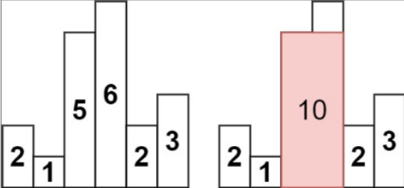

# 84. Largest Rectangle in Histogram

## Problem Statement-

Given an array of integers `heights` representing the histogram’s bar height where the width of each bar is `1`, return the area of the largest rectangle in the histogram.

## Understanding the Problem Statement-

We are given an integer array of `heights` and they represent the bar height of the histogram. The width of each bar is `1`. Now, we have to return the area of the largest rectangle in histogram with the help of the formula: `area = height * width`.

## 1. Brute Force Approach-

For every bar, we treat it as the shortest bar in the rectangle.  
To find how wide this rectangle can extend, we look **left** and **right** until we hit a bar shorter than the current one.  
The width between these two boundaries gives the largest rectangle where this bar is the limiting height.  
We repeat this for every bar and keep track of the maximum rectangle found.

### Algorithm:

1. Let `maxArea` store the largest rectangle found.  
2. For each index `i`:  
    * Let `height` be the height of the current bar.  
    * Expand to the **right** until we find a bar shorter than `height`.  
    * Expand to the **left** while bars are not shorter than `height`.  
    * Compute the width between the boundaries.  
    * Update `maxArea` with `height * width`.  
3. Return `maxArea`.

### Working with Test Cases:

Input: `heights = [2, 1, 5, 6, 2, 3]`  
Output: 10  
Explanation:



When `i=0`:  
`height = 2`, Right expansion: `rightMost = 0`, Left expansion: `leftMost = 0`, `Width = 1` and `area = 2`. So, `maxArea = 2`.  
When `i=1`:  
`height = 1`, Right expansion:  
`heights[2] = 5>=1`,  
`heights[3] = 6 ≥ 1`,  
`heights[4] = 2 ≥ 1`,  
`heights[5] = 3 ≥ 1`,  
End reached, so, `rightMost=5`.  
Left expansion:  
`heights[1] = 1 ≥ 1`,  
`heights[0] = 2 ≥ 1`,  
`index = -1 → stop`,  
So, `leftMost=0`, and `width = 6`, `area = 6`, `maxArea = 6`.  
When `i=2`:  
`height = 5`, Right expansion:  
`heights[3] = 6 ≥ 5`,  
`heights[4] = 2 < 5 → stop`,  
So, `rightMost=3`.  
Left expansion:  
`heights[2] = 5 ≥ 5`,  
`heights[1] = 1 < 5 → stop`,  
`leftMost = 2`.  
`width = 3 - 2 + 1 = 2`, and `area = 5*2 = 10`, so `maxArea = 10`.  
When `i=3`:  
`height = 6`, Right expansion: `heights[4] = 2 < 6 → stop`, `rightMost = 3`. Left expansion: `heights[3] = 6 ≥ 6`, `heights[2] = 5 < 6 → stop`, `leftMost = 3`. `width = 1`, `area = 6`, `maxArea = 10`.  
When `i=4`:  
`height = 2`, Right expansion: `heights[5] = 3 ≥ 2`, end reached,  
`rightMost = 5`. Left expansion:   
`heights[4] = 2 ≥ 2`, `heights[3] = 6 ≥ 2`, `heights[2] = 5 ≥ 2`, `heights[1] = 1 < 2 → stop`, `leftMost = 2`, so `width = 4` and `area = 8`. `maxArea = 10`.  
When `i=5`:  
`height = 3`, Right expansion: end reached, `rightMost = 5`. Left expansion: `heights[5] = 3 ≥ 3`, `heights[4] = 2 < 3 → stop`, `leftMost=5`, `Width = 1`, and `area = 3`, but `maxArea = 10`.  
So, Final output is 10.

### Solution:

```java  
public class Solution {  
    public int largestRectangleArea(int[] heights) {  
        int n = heights.length;  
        int maxArea = 0;

        for (int i = 0; i < n; i++) {  
            int height = heights[i];

            int rightMost = i + 1;  
            while (rightMost < n && heights[rightMost] >= height) {  
                rightMost++;  
            }

            int leftMost = i;  
            while (leftMost >= 0 && heights[leftMost] >= height) {  
                leftMost--;  
            }

            rightMost--;  
            leftMost++;  
            maxArea = Math.max(maxArea, height * (rightMost - leftMost + 1));  
        }  
        return maxArea;  
    }  
}  
```  
So, here the overall Time complexity is `O(n2)`, and Space complexity is `O(1)`.

## 2. Stacks Approach-

For each bar `i`, imagine it as the shortest bar in a rectangle.  
That rectangle can expand:
    * Left until a bar strictly smaller than `heights[i]`  
    * Right until a bar strictly smaller than `heights[i]`

So for every index `i`: if we know:
    * `Left[i]` -> index of previous smaller  element (PSEE)  
    * `Right[i]` -> index of next smaller element (NSEE)

Then the maximum width where `heights[i]` is minimum is:  
`width = right[i] - left[i] - 1`, and `area = heights[i] * width`.

### Algorithm:

1. Compute `left[]`(Previous Smaller Element):  
    * Traverse left -> right  
    * Maintain an increasing stack (store indices)  
    * Pop until top < current height  
    * If stack empty -> `left[i] = -1`  
    * Else -> `left[i] = stack.peek()`  
2. Compute `right[]`(Next Smaller Element):  
    * Traverse right -> left  
    * Maintain an increasing stack  
    * Pop until top < current height  
    * If stack empty -> `right[i] = n`  
    * Else -> `right[i] = stack.peek()`.  
3. Compute Maximum Area:  
    * For each index `i`: `area = heights[i] * (right[i] - left[i] -1)`.

### Working with Test Cases:

Input: `heights = [2, 1, 5, 6, 2 ,3]`  
Output: 10  
Explanation:  
`left[]`:

| i | height | left[i] | reason |
| :---- | :---- | :---- | :---- |
| 0 | 2 | -1 | No left |
| 1 | 1 | -1 | 1 < 2 |
| 2 | 5 | 1 | 1 < 5 |
| 3 | 6 | 2 | 5 < 6 |
| 4 | 2 | 1 | 1 < 2 |
| 5 | 3 | 4 | 2 < 3 |

`left = [-1, -1, 1, 2, 1, 4]`

`Right[]:`

| i | height | right[i] | reason |
| :---- | :---- | :---- | :---- |
| 5 | 3 | 6 | No right |
| 4 | 2 | 6 | Smaller to right |
| 3 | 6 | 4 | 2 < 6 |
| 2 | 5 | 4 | 2 < 5 |
| 1 | 1 | 6 | No smaller |
| 0 | 2 | 1 | 1 < 2 |

`right = [1, 6, 4, 4, 6, 6]`

Area calculation:

| i | height | Width = right - left -1 | area |
| :---- | :---- | :---- | :---- |
| 0 | 2 | 1 | 2 |
| 1 | 1 | 6 | 6 |
| 2 | 5 | 2 | 10 |
| 3 | 6 | 1 | 6 |
| 4 | 2 | 4 | 8 |
| 5 | 3 | 1 | 3 |

So, Final Output is 10.

### Solution:

```java  
class Solution {  
    public int largestRectangleArea(int[] heights) {  
        int n=heights.length;  
        int ans=0;  
        int[] left=leftsmaller(heights);  
        int[] right=rightsmaller(heights);  
        for(int i=0;i<n;i++){  
            int currarea=heights[i] * (right[i] - left[i] - 1);  
            ans=Math.max(ans, currarea);  
        }  
        return ans;  
    }  
    int[] rightsmaller(int[] arr){  
        int n=arr.length;  
        Stack<Integer> s=new Stack<>();  
        int[] right=new int[n];  
        for(int i=n-1;i>=0;i--){  
            while(s.size()>0 && arr[s.peek()]>=arr[i]){  
                s.pop();  
            }  
            right[i] = s.isEmpty() ? n : s.peek();  
            s.push(i);  
        }  
        return right;  
    }  
    int[] leftsmaller(int[] arr){  
        int n=arr.length;  
        Stack<Integer> s=new Stack<>();  
        int[] left=new int[n];  
        for(int i=0;i<n;i++){  
            while(s.size()>0 && arr[s.peek()]>=arr[i]){  
                s.pop();  
            }  
            left[i] = s.isEmpty() ? -1 : s.peek();  
            s.push(i);  
        }  
        return left;  
    }  
}  
```  
So, Overall Time Complexity is `O(n)`, and Overall Space Complexity is `O(n)`.  
