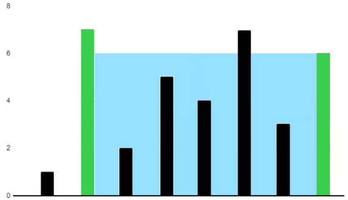

# 11. Container With Most Water

## Problem Statement-

Given an integer array `height` of length `n`. There are `n` vertical lines drawn such that the two endpoints of the `ith` line are `(i, 0)` and `(i, height[i])`.  
Find two lines that together with x-axis form a container, such that container contains most water.  
Return the maximum amount of water a container can store.

## Understanding the Problem Statement-

We are given `height` array which represents the height of the `ith` bar.  
We have to choose two bars to form a container, such that it can hold maximum amount of water.  
Now, here we have to be careful about the bars height, because if water exceeds the largest bar’s height, it will overflow. So, the water contained should be within a small height bar and a bigger height bar.

## 1) Brute Force Approach-

Here, we check all possible containers that can store water. For each pair (i, j), the height of the container is shorter of two lines, and the width is distance between them.

### Algorithm:

1. Initialize `res=0` to track maximum area found.  
2. Use two nested loops:  
* Outer loop runs for left line `i`.  
* Inner loop runs for right line `j>i`.  
3. For each pair `(i,j)` :  
* Compute height to be `min(heights[i], heights[j])`.  
* Width = `j-i`.  
* Update `res` with maximum of current area and new area.  
4. After checking all pairs, return `res`.

### Working with Test Cases:

**Test Case1:**  
Input: `height = [1,7,2,5,4,7,3,6]`  
Output: `36`  
Explanation: 

This is how the image of the heights of bars will look like.  
Now, the outer loop starts from `0th` index and goes to last index.  
The inner loop starts from `outer loop + 1` index and goes until end.  
Here we calculate `width = outer loop - inner loop`,  
`height = min(heights[inner loop], heights[outer loop])`,  
`area = width * height`, and update `res` to be the max of `area` and `res`.  
But this solution is not accepted in general, as it has `O(n2)` complexity which gives Time Limit Exceeded (TLE).

### Solution:

```java  
public class Solution {  
    public int maxArea(int[] heights) {  
        int res = 0;  
        for (int i = 0; i < heights.length; i++) {  
            for (int j = i + 1; j < heights.length; j++) {  
                int width=j-i;  
                int height=Math.min(heights[i], heights[j]);  
                int area=width*height;  
                res = Math.max(res, area);  
            }  
        }  
        return res;  
    }  
}  
```  
Now, this has a time complexity of `O(n2)` and a space complexity of `O(1)`.

## 2) Two Pointers Approach-

Unlike the Brute force approach, two pointer approach solves this problem in `O(n)` time complexity.  
We start at the widest container (left at start, right at end).  
Shorter line limits the height increasing the area, so we move pointer inwards.  
We can also move taller line because it keeps height same but reduces width.

### Algorithm:

1. Initialize two pointers:  
* `left = 0`  
* `right = heights.length - 1`  
2. Set `ans=0` to store maximum area.  
3. While `left<right`:  
* `width = right - left`  
* `height = min(heights[left], heights[right])`  
* `area = width * height`  
* Update `ans` with maximum area  
* Move pointer towards shorter height:  
- [ ] If `(heights[left] <= heights[right])` then move `left` right.  
- [ ] Otherwise move `right` left.  
4. Return `ans` after pointers meet.

### Working with Test Cases:

**Test Case1:**  
Input: `height = [1,7,2,5,4,7,3,6]`  
Output: `36`  
Explanation:  

This is how the image of the heights of bars will look like.  
`left = 0` ,`right = 7` ,`ans = 0`   
For 1st iteration, `width = 7`, `height = min(1, 6) = 1`, `area=7`,  
`ans=7`. Now, since `1<6`: `left=1`.  
Again 2nd iteration, `width = 6`, `height = min(7, 6) = 6, area=36.`Now, since `7>6`: `right=6`.  
Again 3rd iteration, `width = 5` (since `left=1` and `right=6`), `height = min(7, 3) = 3`, `area = 15`, so `ans` remains unchanged, but since `7>3` so `right=5`.  
Now, here we observe that the value `heights[left]` `=7` is the maximum value attained by `heights[left]` and the maximum value attained by `heights[right]` is `6`. In any other cases, area will not be maximum, so `36` is our output.

### 

### Solutions:

```java  
class Solution {  
    public int maxArea(int[] heights) {  
        int left=0, right=heights.length-1, ans=0;  
        while(left<right){  
            int width=right-left;  
            int height=Math.min(heights[left], heights[right]);  
            int area=width*height;  
            ans=Math.max(ans, area);  
            if(heights[left] < heights[right]){  
                left++;  
            }  
            else{  
                right--;  
            }  
        }  
        return ans;  
    }  
}  
```  
Now, here we are using Two-Pointers approach and we already know they give us a time complexity of `O(n)` and Space complexity is `O(1)`.

[image1]: <data:image/png;base64,iVBORw0KGgoAAAANSUhEUgAAAcsAAAEPCAYAAAAte+/lAAAux0lEQVR4Xu2de5Ac1b3fZ3Ylpypx6hphV4zBSf7KrVt1jWNekla2k7pVqWsbCYFtsC/CmCvEw1DXSAKEHcDYwteAsED70EqYaxOSG4IpDEhAkO2LkGRsCNLuCgkLhJBmtQKM9Uav3Z3XL+d3unum55zunenp0709Pd8P9WFH+5hHT8/5zOnp6ckQAAAAACYko34DAAAAALUglgAAAEAdEEsAAACgDoFiWS6Xa/T6nvN9AAAAIC00FctSqSR1B9L9bwAAACBNNBxLdxgLhQIVi0XPaCKWAAAA0kagWB47dowee+wxmj9/Pl199dX0hz/8oRJNxBIAAEBaCRTL1157jebNmydnlhzIa665RsaSVWeXCCcAAIC0ECiWuVyOrr/+etqxYwdt376dli1bJqOJWAIAAEgzDceSGRgYoBtuuIHWr19Pa9eupdtvvx0zSwAAAKknUCxvvfVWWr58eWXHnuuuu46OHz+OWAIAAEg1gWL56KOPypnl6OgojY+P05w5c+RpxBIAAECaaTiWHD4O5K5du+j73/8+3XnnnfTee+9pcVQFAAAAWp1AsXTr9x5LVQAAAKDVCRRLJ5CNhhKxBAAAkAaaiqUaxIkEAAAAWp2GY8kggAAAANqRQLEEAAAA2hHEEgAAAKgDYgkAAADUAbEEAAAA6oBYAgAAAHVALAEAAIA6IJYAAABAHRBLAAAAoA6IJQAAAFAHxBIAAACoA2IJAAAA1AGxBAAAAOqAWAIAAAB1QCwBAACAOiCWAAAAQB0QSwAAAKAOiCUAAABQB8QSAAAAqANiCQAAANQBsQQAAADqgFi2OWX1GwAAADQQyxaD46YaBPVvS7U/BgAA4AFi2ULIwJXLVCwU6djxE/Th0Q/p6NGjgTwivx6ioji3Ev9XRi5B+8CPn7CWSnjMtCOIZYtgzQStB+q23TvogXUP0f2/WUF3v7iM7v4X9n6XP53Qn6y7l8ZKJ0Uwx0UsC/J8g85QAWg1nNAVi0UqFAo18WtU/lv+yn8H2gvEskVwNpkWxYN05sIvUtdr36CZA1+lWQMXU9eWueL0bNsLJ3SG+J0Zmy+hF//0ogjlCXGeHEs+Zzz4QfpZt24dPfnkk/T000/TM888Q2vWrGlY/pvt27fXxBO0D4hli1B5jbFcor8Z/CbN2nIRdQ19jT6/5RvCr4t/z5XfmzVQR/E7X9hyCa3d/7w4r3HxDLmEeSVoC15//XXKZDKUzWalfDqoH/3oRyszUp6dgvYBsWwRKjvllMp0vgjeeSJ8M7fOEQH8mtCaYc4amKvH0WWXjCX/zlxac/A5KpQL4tkxQgnagw0bNlBHR4cWwEZ1AutsusWm2PYCsWwxOJaztl5CM7bOpekiljMHZ0u7Bi+q60zHoTm09uALVORY4gEP2gSOpVf8gsixde/sA9oHxLLF4Acox7JLxLJraK4dSyuCahx1OarCrRfSswfXiVjm5R6xALQDiCUIA2LZYjixnLX1YjuW1RmjHkdVxBK0L4glCANi2WKYjWUBsQRtA2IJwoBYthiIJQDNgViCMCCWLQZiCUBzIJYgDIhli4FYAtAciCUIA2LZYiCWADQHYgnCgFi2GIglAM2hxrIZEcv2BbFsMRBLAJoDsQRhQCxbDMQSgOZALEEYEMsWoXJsWMQSgKZALEEYEMsWwR3LLvtwdzOHqqEMEsuZQyKWh9YRfzyXFUsI0z/wm4gl7xSEULYniGWLgVjCaEz/4I9YgjAgli0GYgmjMf2DP2IJwoBYthiIJYzG9A/+iCUIA2LZYiCWMBrTP/gjliAMiGWLgVjCaEz/4I9YgjAgli0GYgmjMf2DP2IJwoBYthiIJYzG9A/+iCUIQ6BYOiuJWxAviCWMxvQ/lhFLEIbAsSyV+IFV/TeIl0os+eg9IWNZPYIPhOl/LJuOJca/9iJwLFVBvNTE0hXKpmIpZ5ZFMUyqA6c6iML2MN0YiWVHlko8aXBULwQYhtdLdUxSxycHv++bIVAsGR6sC4UCFYvFyr8RzfiQsRyqHhd2xuCc4LEcrB4btij+KxE/6CcS2Uyz1SFGPJY97v20+NKGl7T4BdYdS/uc1eXpFtTH2mIplmPJWZ72ZMzjPlStrr38f/4edykBsczn87Rp0ya66aabaMGCBbR27Vq5Wda6sdYVBtHCy3rmYDWUMwasWOph9JJDOZumb/kKrT2wTjzgRSrLJZdlT9XVEqZR5z9+8uQtD0Tq91pD67/1YWOZtWLp3rIW9LGRdNQth6ZV4e+VirYcTP63tLou8nrnr9Uf8etULPF4Zr20VJ7sWHIcb7/9djp06JD0pZdesm6cHUwQPbycOZbuGWXgWA7Npuf2/wuVxQqaF3dbJYq8gtborLjWqgfTpzWIW/d/QdznBfEESrXoshrV1vnPudbrN6zXAxhQfs2SR2Zn8K8+mVTVQ9kSuh7zcVkU/eAtlY6yJ85M0+P3q39XPV0QfzMu7pdx4ns6ilQGjOV9991HP/jBD2jRokV0xRVX0P79+yd81gDMU4klzyiHLqrs6KOH0cvZIrIX0gUils8fXC8qyQ8O6wGiPgOEbaQc3J1hvjCh1h7UraipWGaIX7qQL2DIJw/WUtNtEvXZzGQYM/IJR1GELp8XsczbsRRXhbeo8hjFC9M+rcpB5Sd5Y5QXoRRP/smKfhQEiuX8+fNpzpw5dOLECTp58iTNmzdPvn7JOK9hgmj54IMPaPqWOdWZpb1HrB5GL62Z5UwR2v/11q/onXffpx0nj9Mfj5dhO3uiTDtOlKRvnih6uqPlLdGvfhsultlsB3V2TKW3To7RtuN5evMYLzNr+Tnyvy1J+qaUl2tr6KwHcSkv91CJBvb/mX6z8QW6bd2PaMnzP6Dvr/0R3b5mKd2x5u4J5J8vpdufuYtue/ZOuufZfnp2428oquIHiuXy5ctp8eLFlanyt771LRlOhp+hgujhZe9shpXBbCKWfPq5A+tpXJxX33CReofL1LuXfCxbP4eptk/c1yuF/R7y96XDbLll7X427GuWWZrykan0sFgWq/fyeRblcnPrtwwty4l35d5SjFrrHa9/T+46QDdvvYc+P/g16hq4RHhxQ35+4CKatWU2zdg6m/7bq1fQrEe+KbciREGgWL7wwgv09a9/nY4fPy7jeNVVV9H4+Lj8GWIZD/wkZebgxdWde8LEspSn3lxBBNMaTGQYXTrf568wvVox8R/oK7FkZTBb0+5nN+gBDGI2Q51Tp9DDwxxLqiwTdXm1WiDd6kGL2BGxDu4t0v98fZhu+MOdNEvE8vMDXxVfL27QufIrby07X5y+5OV/iCiVAWPJs5rdu3fTkiVL6I477qD3339fDt7YBBsfWiwHg8eSf98rlrBdrT/w1wSzRTURy0xHhlbvIVolllm/s9zsGOvLi0Mg5CC0jKUYrV7mzze/TVe/dFvgWDqTBR4Lp2/5Ev3X16+QrxlHQaBYut8m4kTSOY23jsRDJZYD5mJZGTAb0WMQgrAVNBJL4erdZSuUEzwerM2yahwaUY1X3KrXJ1p7h8XX4SL9fMs7dO3v/jt1cSgHLrFjeJGHViR5E+zMAd65cY7cu58nD11bLqSZr3wlGZthHbS96eyAguiZtFh6DAgQtpLGYrmHY1myHjcel8NasSzDCXT2h+gbLoiZ5S66ZuP3K69X6pF0tDa7WrEUY5qYWVZjKca2LXOSFUsweZiPZVF7oMM2VH1ylMInSiZiyW8dWbWHn1zya25WLJ2d4dTLgw0o168i/WLzO7Rgw/dkLGUMeVzjTayKlVjaB2bRvRixBBamY8mbQLQVGLafaiARS82ssEPYn7Njac8sEcsQ+sRSjmu+sbzEiqnzO85pKWIJbBBLGIlqIBFLTY5lZ8YVS8wsw4tYgqhALGEkqoFELDV5VolYGhaxBFGBWMJIVAOJWGoilhGIWIKoQCxhJKqBRCw1EcsIRCxBVCCWMBLVQCKWmvVi6RzuDgawEstdIpa3VWLJbxOpjaBlJZYDHrGU30MsgQ1iCSNRDaSX6t+0mFHHErPLJpwglt7yz1yxdMsHKUAsgQNiCSNVDSRiiVhGaSWWb9OCjUusAxJMeFACJ5bO+yyr77e0vodYAhvEEkaqGkjEErGMROdg6tbpX2zeKWJ5qx1L3tSqRlKPJY9piCXQcD6XFbGEkaoGErFELI3Ly82JpXW6NpZqIBFLIOC7NZAGYsmHiqo5Nqy2MsO204mhGkjEUovlSjuW/coRfBDLRnRCyeNONZaPyFgulq9FNhZLa0xzb4p1XsdELFOKFkMf5aySVWNp7w2mh9FLxBL62Aax7GkklvbB0r3UY2ltRkQsg+iOJW/VcsVy0yI5TgWKpRz/EMu2QI2in4gljFTEErGMRb9YvoVYgolRo+gnYgkjFbFELGPRHUv74wHF95qJpdwE63qfJWKZctQo+olYwkhFLBHLWPSaWSqxtNXHL/4+7yk7F7FsR9Qo+olYwkhFLBHLWPTawUeN5RwZS/VQdyyPXbOGnD1hlVjaXxHLlKJG0U/EEkYqYolYxmJjsayEUI3lkBVLJ5DuWDoililFjaKfiCWMVMQSsYxFxBI0iRpFPxFLGKmIJWIZi4glaBI1in4iljBSEUvEMhYRS9AkahT9RCxbR/6oppb7uCbEErGMRcQSNIkaRT8Ry4RrB8UJZZ8amiCq5x2HzuWq12Wyr5dBEcsk2Fgs+asaShlLe29Yr1jKvxlELFOLGkU/Ectk2ycG0F5h3162SP0evyOtCRAPuo7u74uBWAwmPe+MEg8ofXtK0ccKsUQsY7GRWE6k/dYRr/dZ2l8Ry5SiRtFPxDK58kyyZ6REPeJB/4tckU6eKtOp8QJ9ePIUnRwfp2OnRun46FhF/h57yqXzvYriPI6OET3MA3OuZA3QHpdtTMQSsYzFBmI54RF8qrGUcVTGP8QyxahR9BOxTK48m+wdsfzZ7gLt//NR+ufHfkk/XPqPdM99P6Wld99Dd//jvZY/vpeW/vge+b0fLf2J/B32rrtdin8f/fAUHRsn6t+TF7PWopy5qpdrVMQSsYxFxBI0iRpFPxHL5CpjJo9xWRIDpohbXz9NnfqvKJvtoM6OKdSR7aRspir/uyPL3xfyz2u0fv7MU2soXyhS7+4x6hfnvzKnX65REUvEMhYRS9AkahT9RCyTa+8wz/xE0EQw+/YVafGim/RBWJjNZmtUf16xI0PdPd1y8+zKXJ5Widll/x79co2KWFp6RBKxNCliCZpEjaKfiGUy5dcrOZbWg9+K5aJFC8XgmtUG2yCuELHk1y57cxzKAmJpQMQyCSKWoEnUKPqJWCZTGcu9vPcq7wErHviGYtndbc0se0Qs+4bz2AxrQMQyCSKWoEnUKPqJWCZTNZb9BmM5yrEcFrPLYQ6mftlGRSwRy1hELEGTqFH0E7FMpohl64hYJsEGYjmheJ9l26JG0U/EMpm6Y8kPet9YqoPyRMpYrqiJZW/UsUIsK8veT8TShI3HUo5tiny4O9YJJGLZRqhR9BOxTKaIZeuIWCbBxmJZCWGAWDoililFjaKfiGUyRSxbR8QyCSKWoEnUKPqJWCbT6GL5IGJpWMQyCSKWoEnUKPqJWCbTSGLZkaEexNK4iGUSRCxBk6hR9BOxTKaIZeuIWCZBxBI0iRpFPxHLZBpJLLOIZRQilkmwsVjyVzWUiGWbo0bRT8QymSKWrSNimQQbi6WfPHYhlm2KGkU/Ectk2nAsg0RTxhJ7w5oWsUyCDcRSjGtqJKsilm2LGkU/Ectkili2johlEkQsQZOoUawrYpkoEcvWEbFMgu5YWo8ZxBI0hBbDeqqxtFcQPYxeIpam1WI54hNLdVCeSCWWPXHFUsoh8NP9ex6q55kwEcsk6I4li1iCBtFiWE8nloPNx5J/34lln/wsRnWFhkF0H0h9lbFYOgdSHxMWEUsDGo+lHPQRy2AilqBJtBj6qL1miVgmRsTSVj3PhIlYJkF3LPGaJQiAGkU/EcvkiljaqueZMBHLJIhYgiZRo+gnYplcEUtb9TwTJmKZBBuI5QTifZZtjBpFPxHL5IpY2qrnmTARyyTYeCydo/a4xRF82hg1in4ilskVsbRVzzNhIpZJsLFYVkLYyrEsl8sV3f8GzaFG0U/EMrkilrbqeSZMxDIJtkksnTDygF0oFGrCiWA2hxpFPxHL5IpY2qrnmTARyyTYhrFki8UiYhkSNYp+IpbJFbG0Vc8zYSKWSbBNYulEMpfL0eLFi+nAgQMIZUjUKPppMpbuI/ggluFFLG3V80yYxmOJI/g0oTuWPgclcMLXSCxd8t8mIpZOFEdHR+mBBx6gb3/72zQyMoKZZUjUKPrJS1cG08Dh7vj3K7HMIZZhtA53x8uwIIOySnw1FcuxyuHuJiOWJfFESrjXbVn5t/qzWp2BsCa26uXGqMlY8rLhWFr3P2LZuEos5ROOkhZLGb5GYpnEmSXHkDe7vvXWW7Ru3Tp66KGHEEsDqFH0U4tliJllTSwxswylGsv+FMSy1x3KEbdl5d/qz2p1NrP1uWen6uXGqKlY9u2xYimfUOxFLIOpziy9Y+kEU7MVYsk8/vjjtHTpUvrzn/9M/f39MpwcUB7AEcvmUKPopxPLI0eO0PQtViSnb5ldCaa2UnnKv38hzRB//8vh52n/4YPWyiof+O4ZQHJmA0mWB0rnQOryExTEcuzdPUrXXntN6Fj+eOndNPLue9SzN85YWvc5h2DorRzdd9/99N3vLqTFi2+hm25aJF3YqAsXUt+qXvq/b++T59mvXt4kaDaW4v7OFcVXxDKYTixrrT2Cj34wArf8MpJ7pqkGMxGxnDdvHl155ZW0evVquRn2wQcflJtlnVgimMFRo+inE8s//elPdMHm2XJmGSaW/7zrGXr3g/epvzID8NCJqLbCQ7YaS55Z8sApZhp7xujGG78TOpb3L1tGBw8dnqRYlumXa1+gv/zLv6Jpp3+CPvGJfye/Tpv28QBOo//yN1+kRzZuJh4g+0c8LjNmo4llGbEMpPd400wsK7NMPj1ohZLHxUTE8vDhw3JWeejQIeru7qZt27bVhBKxDI4aRT/dm2G7hqqbYflrkFhWd/B5kQolfrDzQK+vvNVgIpZ+umeWvGdkX46XV17Mqm4KHcvlP11Ox46fkJtheychlt+cfx1ls52U6ZhiK07zvxuQ/y4rbv/pn5hGNy5fRf3ivBFLaGkiltVQVmM5V34/MbHkGDpvGdm0aZPcJIhQhkONop8ylPxVLGd3LJ1NEHoYvRShHGLn0vMH11OhXLR38NFXXsSyvk4s+bW9lcO8LDmaBbrl1pspbCxXrVxJo+P5SZtZfuOqa61YSjuqZho1Q6d9fBrdIGIp9x6Vg6TH5caoiVhOEV/7cmRvdeHXdhHL4OrjTOhY8unBhMWSzefzdOLECe3ABCA4ahT9NBPLOeJvWeutI/lyATPLEKqx5CjwW0duvnlx6Fj2rOimU2NiVrk3PymxvPTbCyibsUPJ8QsUSiuWHzv9Y3Tdsj47lh6XGbOmYrkyRzKUcm9YvGYZQl7fUhpLxh1HVRAcNYp+esVy+sDs0LF0VlZfEUtftVgOW7FcvDj83rDdHMvRaix7cvrlG7VeLAMrZpYiltcv65XnnYodfIRTnVjy67CIZXjlk8AyPfLaznCxTNpmWDcIpRnUKPrpxJJpPpbVzbCIZXhrYil38jEby5Mcy5GkxjI7gdbtSFssO+1YytdgEUszNhXL2lC6x7/E7A2rglCGR42in4hl8my/WLqC6BET9XYilrCuzcRSmVU6bxlJdCxBeNQo+olYJs/0xZLlAJSUWLpuRz1dtwOxhHWVsSzVxtLWiWCNrvdWyq+unyGWKUeNop+TFkupx0oOUxhLfnLER6VxYtmhBaOurtvBsbxOxHIVx0UOipMrYplU1VjaRybjsc3DyozSNatELNsANYp+IpbJM/WxVG9DI7puhzOzRCzhxCKWoAHUKPqJWCbPdMfy6uCxdGJj3w7EEjZm47H0eq0SsWwT1Cj6iVgmz9TFkm9HJZbzw8dyGmIJGxGxBA2gRtFPxDJ5pjeWRTuWrutfT/U2ZKxYfgexhHVFLEEDqFH0E7FMnoilS3ds7NOIJWxMxBI0gBpFPxHL5IlYulRvQwaxhI2qxtJf54AEiGUbokbRT8QyeSKWLtXbkEEsYaM2HstZ8rB2iGVbokbRT8QyeSKWLtXbkEEsYaMqsZzwCD6IZduiRtFPxDJ5IpYu1duQQSxhoyKWoAHUKNaTQSyTYW0sxbJELGtELGFjIpYgIj4/dIlcKSqfZzmkrlB+Vj+i61mOZQmxDGNNLIfzZH1EV9lILPnzLE+OjlHfSIF6h4WRfyYkn3/1Pr/MjqUMpnr9GtQ6KEGfFcu9lurlxLmeNRTLCXRiuSonbsuI/YHWiKUBy/TIlp109YabrFCGjmU0H+6BWLYY/CkvHEueWSKWk2ttLJ3PszQby8rMMvID2nvHMvB1d1kTy8rMMiWxlLdDiWUCZs+taTWWXYglMIXRWJZ5gFcHLEX5c3XlhmztZljWFUv1Y6w8Bl9fxe93d1c3w/aKWPamJpYe61hF9TqZtXvtBu06BlF++HOHFcvK8kIsDejEcmGwzbBKMOX3BxFLYMOxnDXoxHJ25fVIfaXS7XLF8rmD66lQtmMotT7LUFddsaHb2liW7NcsF2sDbSDtWJ4aG7U3w3Iso45J9Tbw7eFYylB2WNdnQtXrbzvt9NPoO8tWKk+41EC6Va+TWY3EMttB/Tn7McPLyhVLPq1eJqxnWczSS/Q/trxNV2+0Y1lHPZZWJGtjqe7tEVQdxLLF4Fhy7GYMXkgzBy6srFyVlaeuPBsVM0sZS8LMMaROLPtEJPtGSrRazix9YqlGZgK7u1fQqfFTcieS3mExu9ybp2iCogaLb0uJLr3q6sDXWfW0aaeLWK4m3kQtY+JzeXHGMpvttD6nU36IdSaQPNOe0tFBK3N5EUZxf/NryTFc71TKTyzkk4syrRq2Yrngd4to1taL5fimj1ve8kxz5qD1N87fmYmlPjtFLFsMK5YX0XRXLOW2eo8VyVsxI91qxbKIWBqRB8xqLEvhY9lhzSxH7Vj2iVj2yb1t1bhEo5FYZjiWHxex/FlCY2l/qHUAK7HcI+4PGUx+EhP99U6lw9ZMvE/GsihiuYsWvLw4WCzlRIF//2LiCYATTGtv2LAili0Px5JXlDCx5BXruUMilsQrLR7sYa3GsihiOcFmWDUoftbEsmwPys7MMnpNxXLa6R+nGziWe3kGVrb3FtUvr6q+bE1aiWU2bCzHExHL6hOQ1rQmlpvtWL7ebCwvQixBLUZiuRWxNCkPmL2VmaXZWK5CLI2ZnljysizJZVqzT4E4zZs0G5JfK5zk11hDx3LIieUl8jRiCWpALJMnYulhxiOWcnDWL6+qvmxN2vKxtHe64/d49rB8Okdy71xLEZ6cWAcbkNerfn7vbuR7WfuLWIJIQSyTJ2LpYQaxNG2fiFtfztr82m2ffvgdoof2kAigtaPMqr3FCeWdk1YNF+SOaN27xO2YxMc/YgkiBbFMnlHEcgViadw0xHKlCOMvxLpwtFimXfsO09CbOdq6c6fwTdq284/CN+j1t73dKhzauZ22735TfH2DThTH6bWjvOOYfllxiFiCSPGN5UQqseS9YRFLc9buDTtBLOvphAYzy0hs9VjKTbA8ixwepQ0b/0DX3/AP9HdXXEHz5s2jeVdcTt+aV8+/o29edqnt12njhvW09Sh/AIDHZcUgYgkiRY9l9cAEflpv5J0gllL1YAQ4KEHDDjc4s2xUxDISWz+W9muTYh37q/90NnV2TJXLOpvNUjbjmKlj9Xdndc2i53fsm7THOGIJIsWJZfWgBI3F0jpwAb9txCOW2qClqq/o0CViqZtJYixfssLCx+1Vl3kDTnYsnc2wK3NFOvOMT8vrY8XSUr2+XsrfFetXh/AzZ59Nj7+2w3pS7HF5UYtYgkixDnenxnLiYCKWEYtY6mYQS6OKZde7h2MpluOePH3qk2dSh32dKrF0LXtf+Xf5EIYylp+h//P//ohYeopYtix818m7MUwsBxHLSDQdyyxiGYUtHcu91syS3+7RKy7/rDPOkp+CooXSXvY1qj9n7Vg+9uob2AzrKWLZspiMpb43bD31FR26RCx1M4ilccXy4/dV9uUKdNaZn6ZOv4Pcu6+3+jOXfy1i+b9fQSy9RSxbFsQywSKWuhnE0rgcS16GxmOJzbC6iGXL4sSyiFgmT8RSN4NYGlfOLHkP9QZjqX5fEbGsZy2IZYuAWCZYxFI3k9ZYTkEsDZn8WNaKWLYIiGWCRSx1MymNZbYFYtmgiGUwEcsWAbFMsIilbialsWyFzbANilgGE7FsERDLBItY6mYQS+MilpqIJdBALBMsYqmbQSyNi1hqIpZAA7FMsIilbgaxNC5iqYlYAg3EMsEilroZxNK4iKUmYgk0EMsEi1jqZhBL4yKWmogl0EAsEyxiqZtBLI2LWGoilkADsUywiKVuBrE0LmKpiVgCDcQywSKWuhnE0riIpSZiCTQQywSLWOpmEEvjIpaaiCXQMBHLLhFLFrE0LGKpm0lnLDsSFMsOxBKxBDoTx5IjqEdSjeUsJZZ8foilASOL5Sj1I5bGDBtLdsoUPjasuD9y45YxXO+KKYzlSjuWj4hYXvP7m6lrqxU8NYp+IpZAY+JY6oH0iuVM1rUZls8PsTQgYqmbSWcsp3bWxrIvhutdMZLNsNvl+WqXFYN98qs7lrcgliA8Tiy9P/xZDyRiGaOIpW4GsTQuYqmZ6FiWxWDtCOIDsUywiKVuBrE0LmKpmdhYlkqlGjmYzlcQLU4seVkjlgkTsdTNIJbGRSw1Wy6WLIgWjqUUsUyeiKVuBrE0LmKpmchYusPoJWaX8WAklmLFQiwNGkMs+xDL0KYilrwM0xbLXCFkLC+WY5vzd4mI5YcffkhPPPEELViwgK688krasGEDghkzvJz57R8cy66B2bZ6IL1jOUc6Q6xQzx58kUplXlnVActLfUUPpxiQxbNJ67yLdrCb3329b5J2fa9YiWVRxLJEN998szbIBjJbjSXv1o9YmjE1sRRxOetTn6YOdZkHNAmx5OXXL26PfJ8lv3UkQCidWM6U8vhmOemxZF555RW68cYb6dVXX6WXX36ZlixZQvl8Xg7gxWIRsYwBXtYzRSCdmSWfbjSWPAudKZwugrlWxLIo7q7+EQ6NOmip6it6GPkB0iueHctgCvtEbPh7/AZlS+vNyn6uHOGBt0Sr3iVatY9jaf46BpJjua8oglCkVUKTscRmWHOmKpZnnJWKWPLjuBLLlxfbW78ad9agiKtwxoAVyhlibJv0WHII33//fXrnnXdofHxcDtqXXXYZjY6OYg/ZGOFlPHNAzA7tTbBBYsmhZGcMVmeW/XJGpw5aqvqK3rwl6hGD54q9YqDZUxADj7j8fbbvluq7T4RJ/P0D75ySAVmxZ4z6cjxLVS8nTkUI9lm3q1+EjZ9EqoNsIMVAtmLFCjo1dkoMjHx7+c3viGVY0xLLPhGXM0Uss2Hun2wCYjnM60SR+sXyfGTz23T17xY1FcsZAyyPiZaJiCUHslAoUC6Xo+XLl8vNsDyjdG+GRTCjhWfyHECeWc4amkPWUXn0QHrFUh7pZ8jaDLvmwIuUL5Ym4TXLknywr86douOFMm3e/Aa9+OLLtH79Jlr/0ovC3wp/U8ff0sbfraeXNvyWtm0fpKc/mNxY8gzZmVmuFAMob31RB9lAioHs3nvvpf2H9suZZe/wuAgxYhlWM7HslLHkw9318iHvYrjeFd2x/OSZqYil3CokluPPX32T/n7jTTKAQTbFJjaW7NjYGP3kJz+hW2+9lY4fP175Pl63jIeDBw/S9C0Xho7lE/teoKMfHp+0WK7cc5RG3j9MX77wS3TOuecJzxF+tup5Z/v6OeG5539WevkVl9Ev953yuJz4lLEcsWK5YtdJmj9/vjbIBlIMZHfeeSft3LWTVonI9AyPIZYGNBpL3jSOWIbSOjZsScbyn17ZQVeJWDp7tKpR9DORsWR27NhBt9xyC/3+97+nY8eO0dGjRyuBxMwyHk6dOiU3w84cmi1jGWRvWA4r7+DDr1k+9cGvaXRsfFJiae0QM0anToyLB/xHxCA0xbZDyANZI1q/29kxhR5567DH5cSo/ZolR2aVob1hH3zwQWszLM8ssRnWiCvWrA8VSpY/daRvD98XhUmMZZ4+lYpYVjfD/uLVt8TMcqEMYNBYJvI1S97pYO7cufTVr36VLr30Urr22mvlHrI820Qo44GX8Sy5QtmhDPSaJTubLhB/47xmWd0rdSL1FT2MPAPjAPAbR63oOZG0BqQg8uCX1ljKvWFzeM3SlBxLbVm7lnkjdmY5luPUv5d3TCtMXizP+FSqYvnIaztp/qZmXrN07w2boLeOHDlyhN577z0aGRmhvXv3yh1+8HplvFRiuTUtsXRmiZmmRCzNi1j6y7HkzbB8m1jEsnkrscyFi2Ui32fJO/N47dCj/htER3pimSe5AsrBCrGsMYtYRqHRWA7z/VFELENoLpYJPIKPqtf3QbSkK5YFfdAKKGJpXsTS307+8OecE0trZmkdiSYGEUvNRMbSjV8sQfQglrUiluZFLL3NZu1YyplldTMsYtmcbRFLMHmkM5bYDFtjFrGMwtCx7EAsTYpYgkipxNJ5jyViiVgatq1iqV7vCUQszYpYgkhxYsmfHoKZJWIZhYilt4ilWRFLECkcyy65osy2ZpYBDkqAWEYkYqmbQSyNi1hqIpbAF8SyVsTSvGmNJR/uzmtZNypiaVbEEkQKYlkrYmlexNJbxNKsiCWIFMSyVsTSvIilt4ilWRFLECmIZa2IpXkRS28RS7MiliBSEMtaEUvzIpbeIpZmRSxBpCCWtSKW5kUsvUUszYpYgkhBLGtFLM2LWHqLWJoVsQSRgljWiliaF7H0FrE0K2IJIgWxrBWxNC9i6S1iaVbEEkRKOmPZvIileRFLbzmWHQmKZdDrr4pYBhOxbDHCxJJPJyWWPYilv1nEMgpXmIhlpx5L9XIiU42lx3UMohXLN8T5lvXLikHEEkRKmFgmaWZpNpZHtMuIVcRSN5PAWOLYsDUilsFELFsMxLJWxNK8iKW3iKVZEUsQKYhlrYileRFLbxFLsyKWIFIQy1oRS/Milt4ilmZFLEGkIJa1IpbmRSy9RSzNiliCSEEsa0UszYtYeotYmhWxBJGCWNaKWJoXsfQWsTQrYpkgOCxhLJVKVCgU5OmkwNcFsayKWJoXsfQWsTQrYpkgOCzFYlEGL5/Py6/Ov53TE+n8HkeTTQKIZa2IpXkRS28RS7MilgnBmR0ODAzQeeedRzNmzKBzzjmHzj333EDy323btk3GMgkzTMSyVsTSvIilt4ilWRHLhODE8q677pLHc3TkwdWt+2eq/HN+QP3whz+UM03E0oyIZR2ziGUUIpa1IpbBTH0sFy5c6BtK7YGj6PzebbfdVjm/yQax1O8jxNKsiKW3iKVZEcuE4MSNB64ggfTye9/7nnr2kwZiWStiaV7E0lvE0qyIZUJALBHL2EQsdTOIpXERS03E0gCIJWIZm4ilbgaxNC5iqYlYGgCxRCxjE7HUzSCWxkUsNRFLAyCWiGVsIpa6GcTSuIilJmJpAMQSsYxNxFI3g1gaF7HURCwNgFgilrGJWOpmEEvjIpaaiKUBTMfSOb/JBrGsFbE0L2LpLWJpVsQyISCWiGVsIpa6GcTSuIilJmJpAMQSsYxNxFI3g1gaF7HURCwNgFgilrGJWOpmEEvjIpaaiKUBEEvEMjYRS90MYmlcxFITsTQAYolYxiZiqZtBLI2LWGoilgZALBHL2EQsdTOIpXERS03E0gCIJWIZm4ilbgaxNC5iqYlYGgCxRCxjE7HUzSCWxkUsNRFLAyCWiGVsIpa6GcTSuIilJmJpAMQSsYxNxFI3g1gaF7HURCwNgFgilrGJWOpmEEvjIpaaiKUBEEvEMjYRS91MOmPZ0ZmgWHpcxyAilsFMbSwdnFhqD5IAJiuWZIdPRHJIxHKg8Vg6f3e+jOV6GcveHD/o1UFLVV/Rw9g7nKfuYV4B82L5hrtvkhBLDkG/CEzvu3lavS9Pixbdol3PoK54sJvGx05S/x5x/iOj1C2Cqd8v0Slj6THANqR9G6ad/gm6cdnD1CPu7x6Opceyi9Owscx0Zmhqdir1iVj2i1j27huLL5QsxzLHkcnTmWecRZ1Br7/iZz7z1/TYK9v1y4nRXg51bowe2byT/n7jzTTzdT2IE9klYjlLxPICGctLaIb4qkbOlIhlAyKW+koeRsSyvoileRHLWhHLYCKWDYhY6it5GBHL+qqx7GnBWJ4mN8NyLAvi+lO8YfEwbbGcEvT6KyKWwWw4lkkIRTMglohl1NbEciRPi03E8gE7lrvFjGxkrHVjed/D8nUpxNKAIpar+TVL8fg564x/L66Lx3VsUH69MxWxFH5h8GvJiiVTLBbpxIkT9Morr9DmzZupUChIOSKlUikRMVExFcukEDaWvEMQYmnWnlyJevaM0woRtVUj40Zi2b2ih8bGjtPDI2Iw2Tcud4jS75foDBVLVtyG06ZxLH8mgsI7PyUwlup1rqdHLNXLiNJ+4UNifejZM0ZnffLTTW2G5Uh2dmblzkpnn302PbHlTe1y4tQ7lnO0KE7kF4a8YmmeQLEcGxujNWvW0GWXXSYdGBiQseRQckiTMvtyg1gillFrRaBIy3MnxUA6aiSW9y/7KZ08eVTMJKxY9o60bixXjvAetohlWDmWvD70icvmmeUUHtfU61jHDhHKqVM7aepHOkUsP0OPv7ZDu5w4NRHLLyYxlk888QRdf/31MowcyAULFtD4+LgMpDPDTBqIJWIZtRwB3gzb866I2p6T9N3vLtSuZ1B5M+zY2Anq38NvHRkTsWzkfjKnqVh+x4nlPsQytMNE//QeP2bH6T+c+R+pU71+AezoyNJn//Nn6cmBnfrlxGhqY3nXXXfR8uXLZSxHR0fp8ssvF89+T1ZmlBzQY8eO0ZEjRxLjDTfcEDqWixYt0s53sjx8+DBN3/hlumDj39L0TV+iCzb8rTjN//aWf9ct/9054m8e372WDh0+QsteP0D3bztUxyNGvW/bfrpXnO+RIwe0ZR1Uvm9Xbh7WLiNOlwn7dh2hB97eT/ds2UezumZp1zOoX/nKhXT/T++jB7Ydpnu2vkfL3mjkfgrp9qpzL/+WNsAGUtyGvzhtGl39owfp/jcO0bI/imW1fXK957G12nLWrvdE8kEJslPo/q0HaPm2A+I2faBdRqTyujZ0iO7b+gF97C+m0b/9N/9av4515M2wHEo+fdanz6I7f/64fjkxep9Yv+9//QNauX4LzXv+Rjr/5S/T+WJcO38Tf23Mrk0X0bni6wWbZtN54qs6ZjargzMJDBTLO+64Q75Z2plFXnPNNTKOTiw5op/73OdoypQp+koJIQxguCd4TekxuDZt5XyDbyqMTPX2NnObm/mbKEzSck2a6n3cpDz5Y5qK5aOPPkpLliyRZ8LBnD9/PuXz+ZqdfH7961/T008/TU8++ST96le/kqchhMn2qTZQvc1PP/2UkMcomC7V+zmYTz31FD3zzDOVCWBTseRZ5NKlS+nuu++W0Xzuuecqs0onls6ZJ3XvWACAjngEU4nlx25KdY9VljxG8XgFUyPx1+a747TLPQlsKpb8R/ya2XXXXSd3nDl69GhNFJ0Lca+QAIDk48SyWE6vejA9BlvY2oaMJcN/zx1T3+ERKJZeeF0xxBKA1oIfqe3gxKi/raq/UR0m0fB4tSt0LAEArY+ahbQaDnVQhsk0GhBLAIAWlbQaDnVQhsk0GhBLAIAWlbQaDnVQhsk0GhBLAIAWlbQaDnVQhsk0GhBLAIAWlbQaDnVQhsk0GhBLAIAWlbQaDnVQhsk0GhBLAIAWlbQaDnVQhsk0Gv4/WfvUU7E58TEAAAAASUVORK5CYII=>