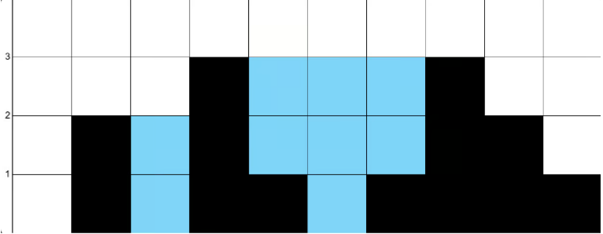

# 42. Trapping Rainwater

## Problem Statemtent-

Given `n` non-negative integers representing an elevation map where the width of each is `1`, compute how much water it can trap after raining.

## Understanding the Problem Statement-

We are given `height` which represents an elevation map. Each value  
of `height[i]` represents the height of bar and it has a width of `1`. After rainfall, return the maximum area of water the can be trapped between the bars.

## 1. Brute Force Approach-

For each position, water trapped depends on tallest bar to its left and tallest bar to its right. The water at index `i` is: `min(leftMax, rightMax) - height[i]`.  
This method recomputes left maximum and right maximum for every index by scanning array each time.

### Algorithm:

1. If input list is empty, return `0`.  
2. Calculate length of array and initialize `res=0`.  
3. For each index:  
    * Evaluate `leftMax` from `0` to `i`  
    * Evaluate `rightMax` from index `i+1` to end  
    * Add `min(leftMax, rightMax) - height[i]` to `res`.  
4. After processing all positions, return `res`.

### Working with Test Cases:

**Test Case1:**  
Input: `height = [0, 2, 0, 3, 1, 0, 1, 3, 2, 1]`  
Output: `9`  
Explanation:



| i | `height[i]` | `leftMax` | `rightMax` | Water at i |
| :---- | :---- | :---- | :---- | :---- |
| 0 | 0 | `max(0)=0` | `max(2,0,3,1,0,1,3,2,1) = 3` | `min(0,3) - 0 = 0` |
| 1 | 2 | `max(0,2)=2` | `max(0,3,1,0,1,3,2,1) = 3` | `min(2,3) - 2 = 0` |
| 2 | 0 | `max(0,2,0) = 2` | `max(3,1,0,1,3,2,1) = 3` | `min(2,3) - 0 = 2` |
| 3 | 3 | `max(0,2,0,3) = 3` | `max(1,0,1,3,2,1) = 3` | `min(3,3) - 3 = 0` |
| 4 | 1 | `max(0,2,0,3,1) = 3` | `max(0,1,3,2,1) = 3` | `min(3,3) - 1 = 2` |
| 5 | 0 | `max(...,0) = 3` | `max(1,3,2,1) = 3` | `min(3,3) - 0 = 3` |
| 6 | 1 | `max(...,1) = 3` | `max(3,2,1) = 3` | `min(3,3) - 1 = 2` |
| 7 | 3 | `max(...,3) = 3` | `max(2,1) = 2` | `min(3,2) - 3 = 0` |
| 8 | 2 | `max(...,2) = 3` | `max(1) = 1` | `min(3,1) - 2 = 0` |
| 9 | 1 | `max(...,1) = 3` | `max(1) = 1` | `min(3,1) - 1 = 0` |

### Solution:

```java  
public class Solution {  
    public int trap(int[] height) {  
        if (height == null || height.length == 0) {  
            return 0;  
        }  
        int n = height.length;  
        int res = 0;

        for (int i = 0; i < n; i++) {  
            int leftMax = height[i];  
            int rightMax = height[i];

            for (int j = 0; j < i; j++) {  
                leftMax = Math.max(leftMax, height[j]);  
            }  
            for (int j = i + 1; j < n; j++) {  
                rightMax = Math.max(rightMax, height[j]);  
            }

            res += Math.min(leftMax, rightMax) - height[i];  
        }  
        return res;  
    }  
}  
```  
Now, here nested loops are being used, so `T(n) = O(n^2)` and `S(n) = O(1).` 

## 2. Prefix and Suffix Arrays Approach-

We can precompute the tallest bar to left and right values with the help of two arrays:  
`leftMax[i]` = tallest bar from start to `i`.  
`rightMax[i]` = tallest bar from end to `i`.  
The water at `i` is: `min(leftMax[i], rightMax[i]) - height[i]`

### Algorithm:

1. Return `0` if array is empty.  
2. Create two arrays `leftMax` and `rightMax` of size `n`.  
3. Fill `leftMax`:  
    * `leftMax[0] = height[0]`  
    * For `1` to `n-1`: `leftMax[i] = max(leftMax[i - 1], height[i])`  
4. Fill `rightMax:`  
    * `rightMax[n-1] = height[n-1]`  
    * For `n-2` to `0`, `rightMax[i] = max(rightMax[i+1], height[i])`  
5. Compute trapped water:  
    * Add `min(leftMax[i], rightMax[i]) - height[i]` to result.  
6. Return total trapped water.

### Working with Test Cases:

**Test Case1:**  
Input: `height = [0, 2, 0, 3, 1, 0, 1, 3, 2, 1]`  
Output: `9`  
Explanation:  


Build `leftMax[i]`:

| i | `height[i]` | `leftMax[i]` |
| :---- | :---- | :---- |
| 0 | 0 | 0 |
| 1 | 2 | `max(0,2)=2` |
| 2 | 0 | `max(2,0)=2` |
| 3 | 3 | `max(2,3)=3` |
| 4 | 1 | `max(3,1)=3` |
| 5 | 0 | `max(3,0)=3` |
| 6 | 1 | `max(3,1)=3` |
| 7 | 3 | `max(3,3)=3` |
| 8 | 2 | `max(3,2)=3` |
| 9 | 1 | `max(3,1)=3` |

`leftMax = [0, 2, 2, 3, 3, 3, 3, 3, 3, 3]`

Build `rightMax[i]`:

| i | `height[i]` | `rightMax[i]` |
| :---- | :---- | :---- |
| 9 | 1 | 1 |
| 8 | 2 | `max(1,2)=2` |
| 7 | 3 | `max(2,3)=3` |
| 6 | 1 | `max(3,1)=3` |
| 5 | 0 | `max(3,0)=3` |
| 4 | 1 | `max(3,1)=3` |
| 3 | 3 | `max(3,3)=3` |
| 2 | 0 | `max(3,0)=3` |
| 1 | 2 | `max(3,2)=3` |
| 0 | 0 | `max(3,0)=3` |

`rightMax = [3, 3, 3, 3, 3, 3, 3, 3, 2, 1]`  
Now we calculate trapped water:   
`water = min(leftMax[i], rightMax[i]) - height[i]`

| i | height | leftMax | rightMax | water |
| :---- | :---- | :---- | :---- | :---- |
| 0 | 0 | 0 | 3 | 0 |
| 1 | 2 | 2 | 3 | 0 |
| 2 | 0 | 2 | 3 | 2 |
| 3 | 3 | 3 | 3 | 0 |
| 4 | 1 | 3 | 3 | 2 |
| 5 | 0 | 3 | 3 | 3 |
| 6 | 1 | 3 | 3 | 2 |
| 7 | 3 | 3 | 3 | 0 |
| 8 | 2 | 3 | 2 | 0 |
| 9 | 1 | 3 | 1 | 0 |

`res = 2 + 2 + 3 + 2 = 9`.  
So, Output is 9.

### Solution:

```java  
public class Solution {  
    public int trap(int[] height) {  
        int n = height.length;  
        if (n == 0) {  
            return 0;  
        }

        int[] leftMax = new int[n];  
        int[] rightMax = new int[n];

        leftMax[0] = height[0];  
        for (int i = 1; i < n; i++) {  
            leftMax[i] = Math.max(leftMax[i - 1], height[i]);  
        }

        rightMax[n - 1] = height[n - 1];  
        for (int i = n - 2; i >= 0; i--) {  
            rightMax[i] = Math.max(rightMax[i + 1], height[i]);  
        }

        int res = 0;  
        for (int i = 0; i < n; i++) {  
            res += Math.min(leftMax[i], rightMax[i]) - height[i];  
        }  
        return res;  
    }  
}  
```  
Here, we are using prefix and suffix arrays, so it has a better time complexity than brute force : `O(n)` and Space complexity is `O(n)`.

## 

## 3. Stack Approach-

We use a monotonic decreasing stack to store indices  
When we see a bar that is taller than the bar on top of the stack, it means we’ve found a right wall for a container.  
The bar we pop is the bottom, and the new top of the stack becomes the left wall.  
With a left wall, bottom, and right wall, we can calculate how much water fits in between.  
We keep doing this as long as the current bar keeps forming valid containers.

### Algorithm:

1. Create an empty stack and set `res=0`.  
2. Loop through each index `i`:  
    * While stack is not empty and `height[i]` is taller than bar at stack’s top:  
        - [ ] Pop top index which is the bottom  
        - [ ] If stack not empty:  
    * Compute trapped water between new top which is left wall and current top which is right wall  
    * Add to `res`.  
3. Return `res` after loop finishes.

### Working with Test Cases:

**Test Case1:**  
Input: `height = [0, 2, 0, 3, 1, 0, 1, 3, 2, 1]`  
Output: `9`  
Explanation:


At `i=0,` stack is empty and push index.  
At `i=1,` `height[1]>=height[0]` so pop, `mid=0` no left boundary and push index 1 in stack.  
At `i=2,` `height[2] < height[1]` so, no pop.  
At `i=3`, we perform 1st pop, `height[3] ≥ height[2]:`  
`mid = height[2] = 0`, `left = height[1] = 2`, `right = height[3] = 3`, `h = min(2,3) - 0 = 2`, `w = 3 - 1 - 1 =, res += 2 * 1 = 2`  
Then the 2nd pop, `height[3] ≥ height[1]`  
`mid = height[1] = 2`  
`stack empty → no left boundary`  
At `i=4`, `height[4] < height[3]` so, no pop  
At `i=5`, `height[5] < height[4]` so, no pop  
At `i=6`, `height[6] ≥ height[5]`:  
`mid = height[5] = 0`  
`left = height[4] = 1`  
`right = height[6] = 1`  
`h = min(1,1) - 0 = 1`  
`w = 6 - 4 - 1 = 1`  
`res += 1 * 1 = 1`  
At `i=7`, first pop,   
`mid = height[6] = 1`  
`left = height[4] = 1`  
`right = height[7] = 3`  
`h = min(1,3) - 1 = 0`  
`w = 7 - 4 - 1 = 2`  
`res += 0`  
Then second pop:  
`mid = height[4] = 1`  
`left = height[3] = 3`  
`right = height[7] = 3`  
`h = min(3,3) - 1 = 2`  
`w = 7 - 3 - 1 = 3`  
`res += 2 * 3 = 6`  
Then third pop:  
`mid = height[3] = 3`  
stack empty and no left boundary  
At `i=8`, `height[8] < height[7]` : `stack = [7, 8], res = 9`  
At `i=9`, `height[9] < height[8]` :`stack = [7, 8, 9] res = 9`

### Solution:

```java  
public class Solution {  
    public int trap(int[] height) {  
        if (height.length == 0) {  
            return 0;  
        }

        Stack<Integer> stack = new Stack<>();  
        int res = 0;

        for (int i = 0; i < height.length; i++) {  
            while (!stack.isEmpty() && height[i] >= height[stack.peek()]) {  
                int mid = height[stack.pop()];  
                if (!stack.isEmpty()) {  
                    int right = height[i];  
                    int left = height[stack.peek()];  
                    int h = Math.min(right, left) - mid;  
                    int w = i - stack.peek() - 1;  
                    res += h * w;  
                }  
            }  
            stack.push(i);  
        }  
        return res;  
    }  
}  
```  
Here stacks are used and linearly time is consumed so `T(n) = O(n)`  
And `S(n) = O(n)`.

## 4. Two Pointers Approach-

Now, after doing 3 approaches, we know that water at any position depends on the shorter wall between left and right sides.  
If left wall is shorter, water is limited by left side then.  
We then move left pointer inwards and calculate how much water can be trapped. If right wall is shorter, move right pointer left.  
Water at each position is simply: `max wall on that side - height at that position`.

### Algorithm:

1. Set two pointers:  
    * `Left` at start  
    * `Right` at end   
    * Track `leftMax` and `rightMax` to be the tallest walls.  
2. While `left<right`:  
    * If `leftMax<rightMax`:  
        - [ ] Move `left` right  
        - [ ] Update `leftMax`  
        - [ ] Add `leftMax - height[i]` to result  
    *  else:  
        - [ ] Move `right` left  
        - [ ] Update `rightMax`  
        - [ ] Add `rightMax - height[r]` to result.  
3. Return total trapped water.

### Working with Test Cases:

**Test Case1:**  
Input: `height = [0, 2, 0, 3, 1, 0, 1, 3, 2, 1]`  
Output: `9`  
Explanation:


| Step | left | right | `height[left]` | `height[right]` | lmax | rmax | Action | Water added | ans |
| :---- | :---- | :---- | :---- | :---- | :---- | :---- | :---- | :---- | :---- |
| 1 | 0 | 9 | 0 | 1 | `max(0,0)=0` | `max(0,1)=1` | lmax < rmax → move l | `0−0 = 0` | 0 |
| 2 | 1 | 9 | 2 | 1 | `max(0,2)=2` | 1 | else → move r | `1−1 = 0` | 0 |
| 3 | 1 | 8 | 2 | 2 | 2 | `max(1,2)=2` | else → move r | `2−2 = 0` | 0 |
| 4 | 1 | 7 | 2 | 3 | 2 | `max(2,3)=3` | lmax < rmax → move l | `2−2 = 0` | 0 |
| 5 | 2 | 7 | 0 | 3 | `max(2,0)=2` | 3 | lmax < rmax → move l | `2−0 = 2` | 2 |
| 6 | 3 | 7 | 3 | 3 | `max(2,3)=3` | `max(3,1)=3` | else → move r | `3−3 = 0` | 2 |
| 7 | 3 | 6 | 3 | 1 | 3 | `max(3,1)=3` | else → move r | `3−1 = 2` | 4 |
| 8 | 3 | 5 | 3 | 0 | 3 | `max(3,0)=3` | else → move r | `3−0 = 3` | 7 |
| 9 | 3 | 4 | 3 | 1 | 3 | `max(3,1)=3` | else → move r | `3−1 = 2` | 9 |

### Solution:

```java  
class Solution {  
    public int trap(int[] height) {  
        int n=height.length;  
        int l=0, r=n-1;  
        int ans=0;  
        int lmax=0, rmax=0;  
        while(l<r){  
            lmax=Math.max(lmax,height[l]);  
            rmax=Math.max(rmax,height[r]);  
            if(lmax<rmax){  
                ans+=lmax-height[l];  
                l++;  
            }  
            else{  
                ans+=rmax-height[r];  
                r--;  
            }  
        }  
        return ans;  
    }  
}  
```  
Now, we are using the best approach as this takes `O(n)` time complexity and `O(1)` Space complexity.
